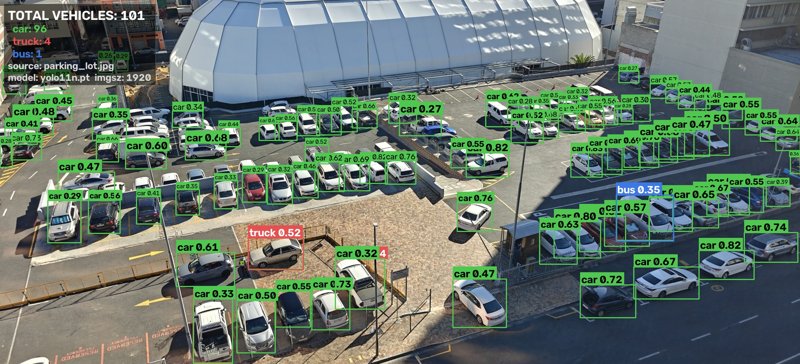

# Parking Lot Vehicle Counter

Detect and count vehicles — **car, motorcycle, bus, truck** — in parking-lot images and
video using a **pre-trained** YOLO11 model. No training involved: the weights are
downloaded ready-made on first run.



*101 vehicles found in the sample lot. Boxes are coloured per class; captions carry the
class and its confidence score.*

## What it does

- Runs a pre-trained Ultralytics **YOLO11** model over an image or a video.
- Draws **bounding boxes, class labels and confidence scores**.
- Reports a **total** and a **per-class breakdown**.
- Saves the annotated image/video plus a JSON summary (and a per-frame CSV for video).
- **Bonus:** counts only inside a **Region of Interest** you draw.
- **Bonus:** a **Streamlit** UI that does all of the above in the browser.

For video it reports two different numbers, because they answer different questions:

| Number | Meaning | Use it for |
|---|---|---|
| **Occupancy** | vehicles visible in a single frame | "How full is the lot right now?" |
| **Unique vehicles** | distinct tracker IDs across the clip | "How many came through?" |

Summing per-frame counts would be meaningless — a car parked for 300 frames would be
counted 300 times.

---

## Setup

Requires **Python 3.10+**. The commands below use [`uv`](https://github.com/astral-sh/uv);
plain `pip` works exactly the same.

```bash
git clone <your-repo-url>
cd vehicle-counter

# create and activate an environment
uv venv
source .venv/bin/activate          # Windows: .venv\Scripts\activate

# install dependencies
uv pip install -r requirements.txt

# fetch the sample image and video (~9 MB)
python tools/fetch_samples.py
```

<details>
<summary>Using plain pip instead</summary>

```bash
python3 -m venv .venv
source .venv/bin/activate
pip install -r requirements.txt
python tools/fetch_samples.py
```
</details>

> On the **first detection run** Ultralytics downloads `yolo11n.pt` (~5 MB). That pause
> is expected and happens only once.

---

## Run it

### Image

```bash
python detect_vehicles.py --source data/input/parking_lot.jpg
```

```
Vehicles detected
-----------------
  car            96
  truck           4
  bus             1
  TOTAL         101

Annotated image : outputs/parking_lot_annotated.jpg
Counts JSON     : outputs/parking_lot_counts.json
```

### Video

```bash
python detect_vehicles.py --source data/input/street_traffic.mp4
```

```
Busiest frame (peak occupancy)
------------------------------
  car            15
  TOTAL          15

  mean occupancy : 8.1 vehicles per frame

Unique vehicles across the clip (track seen in >= 3 frames)
-----------------------------------------------------------
  car           112
  truck           4
  bus             2
  motorcycle      1
  TOTAL         119

  raw track ids before filtering: 263
```

### Count only inside a Region of Interest (bonus)

There are two ways to draw one, and both produce the same JSON file.

**In the web UI** — pick *Draw polygon*, then click points directly on the picture.
Undo/Clear as you go, and **Save region** writes it to `data/roi/` so it is reusable
from the command line afterwards.

**From the desktop picker:**

```bash
python tools/roi_picker.py --source data/input/parking_lot.jpg --out data/roi/main_lot.json
python detect_vehicles.py --source data/input/parking_lot.jpg --roi data/roi/main_lot.json
```

Restricting to the main lot drops the count from **101 to 47**, excluding the separate
right-hand lot and the public street:


`tools/roi_picker.py` controls: **left click** add point · **right click** undo ·
`r` reset · `s` save · `q` quit.

An ROI is stored as fractions of the frame, so the same file keeps working if the
same scene is later supplied at a different resolution.

### Web UI (bonus)

```bash
streamlit run app.py
```

Everything the brief asks for is reachable from the page:

- choose a bundled sample or upload your own image/video,
- tune confidence, IoU, inference size and which classes to count,
- **draw an ROI polygon by clicking on the picture**, or use a rectangle, a saved
  region, or an uploaded JSON file,
- see the annotated result with boxes, labels and confidence scores,
- read the total and per-class counts (plus occupancy and unique-vehicle counts,
  and an occupancy-over-time chart, for video),
- inspect every raw detection in a table, and download the processed file.

---

## Command reference

| Flag | Default | What it does |
|---|---|---|
| `--source` | *required* | Image or video file. Type is detected from the extension. |
| `--model` | `yolo11n.pt` | Any Ultralytics model. `yolo11s/m/l/x.pt` are slower but more accurate. |
| `--conf` | `0.25` | Minimum confidence. Lower finds more vehicles and more false ones. |
| `--iou` | `0.45` | NMS IoU threshold — how much two boxes may overlap before one is suppressed. |
| `--imgsz` | `auto` | Inference resolution. `auto` matches the source (capped at 1920). **The single biggest lever on accuracy** — see NOTES.md. |
| `--device` | auto | `mps`, `cpu`, or `0` for CUDA. |
| `--classes` | the 4 vehicle classes | e.g. `--classes car truck`. `bicycle` is also available. |
| `--roi` | none | ROI JSON file. Only vehicles inside it are counted. |
| `--roi-rule` | `bottom` | Which point must be inside: `bottom` (ground contact), `center`, or `overlap`. |
| `--labels` | `auto` | `auto` shrinks captions to fit the box, `full` always writes them, `none` draws boxes only. |
| `--min-track-hits` | `3` | Video: frames a track must survive to count as a unique vehicle. |
| `--stride` | `1` | Video: process every Nth frame. |
| `--max-frames` | all | Video: stop after N frames — handy for a quick test. |
| `--no-track` | off | Video: disable tracking (no unique count). |
| `--out` | `outputs` | Output directory. |
| `--no-json` | off | Skip the JSON/CSV sidecar files. |

## Output files

| File | Contents |
|---|---|
| `<name>_annotated.jpg` / `.mp4` | The annotated result. Video is re-encoded to H.264 so it plays in browsers. |
| `<name>_counts.json` | Settings used, totals, per-class counts, and every box with its confidence. |
| `<name>_per_frame.csv` | Video only: occupancy and per-class counts for each frame. |

## Project layout

```
detect_vehicles.py        CLI entry point
app.py                    Streamlit UI (bonus)
vehicle_counter/
├── config.py             class ids, colours, defaults, device + imgsz selection
├── detector.py           YOLO wrapper -> plain Detection objects
├── roi.py                Region of Interest: load/save, containment tests (bonus)
├── annotate.py           boxes, labels, ROI overlay, count panel
└── pipeline.py           process_image() / process_video()
tools/
├── fetch_samples.py      download the sample media
└── roi_picker.py         click out an ROI and save it as JSON (bonus)
examples/                 committed sample outputs
```

Both front ends call the same `pipeline` functions, so the CLI and the UI can never
disagree about what a count means.

---

## Troubleshooting

**`ModuleNotFoundError: No module named 'lap'`** — tracking needs it:
`pip install lap`. It is already in `requirements.txt`.

**Very few vehicles detected.** Almost always inference resolution. Confirm `--imgsz`
is `auto`, or set it explicitly (`--imgsz 1920`). On the sample lot this is the
difference between **9** and **101** detections.

**The output video will not play.** Install `ffmpeg` (`brew install ffmpeg`). Without
it OpenCV writes an `mp4v` file that most browsers refuse to play; with it the result
is re-encoded to H.264 automatically.

**Slow on CPU.** Expected — roughly 5× slower than Apple's MPS backend on this machine.
Use `--stride 2` or a smaller `--imgsz` to speed video up.

## Version control

This repository is not initialised for you. After creating an empty repo on your host:

```bash
git init
git add .
git commit -m "Vehicle detection and counting with pre-trained YOLO11"
git branch -M main
git remote add origin <your-repo-url>
git push -u origin main
```

`.gitignore` already excludes the virtual environment, model weights, the `outputs/`
working directory, and the downloaded sample media.

## Documentation

| Document | What is in it |
|---|---|
| **[NOTES.md](NOTES.md)** | The approach, how to read YOLO's output, measured observations, and an honest account of where this solution fails — including a bundled video on which it detects almost nothing, and why. |
| **[WALKTHROUGH.md](WALKTHROUGH.md)** | A complete end-to-end explanation: setup, how YOLO works internally (architecture, raw output tensors, NMS, letterboxing), every source file, the tracking algorithm, the ROI geometry, the UI's execution model, and a Q&A section. |

## Credits

Sample media is openly licensed; see `data/input/SOURCES.md` (written by the fetch
script) for per-file attribution. The parking-lot photograph is by **Husskeyy**
(CC BY-SA 4.0) via Wikimedia Commons.
